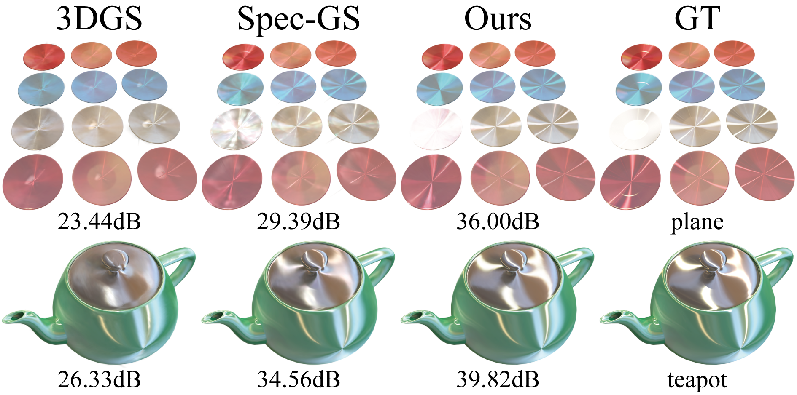
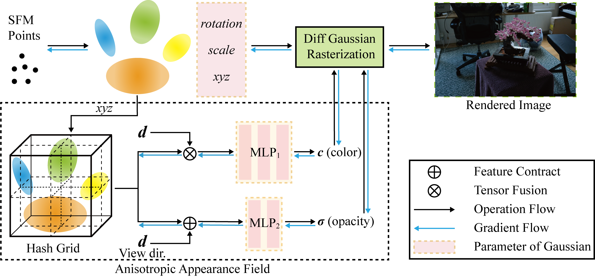

# Aniso-GS: Anisotropic Appearance Field for 3D Gaussian Splatting



This project aim to enhance 3D Gaussian Splatting in modeling scenes with specular highlights. I hope this work can assist researchers who need to model specular highlights through splatting.

## Dataset

In our paper, we use:

- synthetic dataset from [NeRF](https://drive.google.com/drive/folders/128yBriW1IG_3NJ5Rp7APSTZsJqdJdfc1), and [Anisotropic Synthetic Dataset] from [Spec-Gaussian](https://drive.google.com/drive/folders/1hH7qMSbTyR392PYgsqeMhAnaAxwxzemc?usp=drive_link)
- real-world dataset from [Mip-NeRF 360](https://jonbarron.info/mipnerf360/), and [Tandt\&Temple + Deepending] from [3DGS](https://repo-sam.inria.fr/fungraph/3d-gaussian-splatting/datasets/input/tandt_db.zip).


And the data structure should be organized as follows:

```shell
data/
├── nerf_synthetic
│   ├── Chair/
│   ├── Drums/
│   ├── ...
├── anisotropic
│   ├── ashtray/
│   ├── dishes/
│   ├── ...
├── 360_v2
│   ├── bicycle/
│   ├── bonsai/
│   ├── ...
├── tandt_db
│   ├── db/
│   │   ├── drjohnson/
│   │   ├── playroom/
│   ├── tandt/
│   │   ├── train/
│   │   ├── truck/
```


## Pipeline




## Run

### Environment

```shell
git clone https://github.com/liganggis/Aniso-GS
cd Aniso-GS

conda create -n aniso-gs-env python=3.10
conda activate aniso-gs-env

# install pytorch
pip install torch==1.13.1+cu116 torchvision==0.14.1+cu116 --extra-index-url https://download.pytorch.org/whl/cu116
pip install torch-scatter -f https://data.pyg.org/whl/torch-1.13.0+cu116.html

# install dependencies
pip install -r requirements.txt

# install submodules
Unzip the zip file in the submodules folder, then
pip install submodules/diff-gaussian-rasterization
pip install submodules/simple-knn
pip install submodules/gridencoder
pip install submodules/shencoder
```
### Train

We have provided the script in the folder (https://github.com/liganggis/Aniso-GS/sbatch/) that were used to generate the table in the paper.

## Acknowledgments

...


## BibTex


And thanks to the authors of [3D Gaussians](https://repo-sam.inria.fr/fungraph/3d-gaussian-splatting/) and [torch-ngp](https://github.com/ashawkey/torch-ngp) for their excellent code, please consider citing these repositories.
